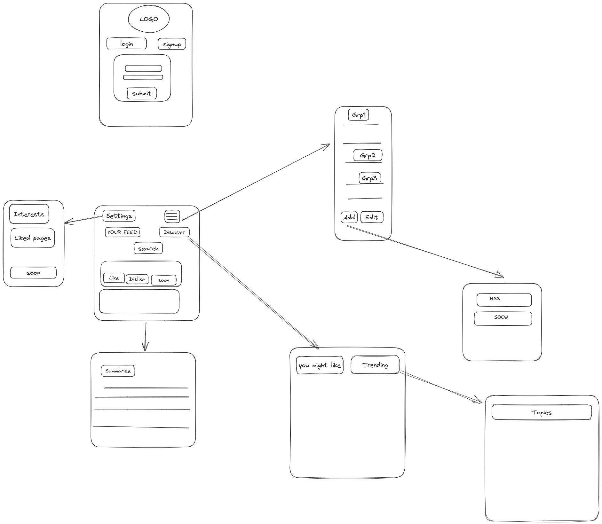

- [بسم الله الرحمن الرحيم](#بسم-الله-الرحمن-الرحيم)
  - [model 2](#model-2)
    - [model](#model)
    - [notes](#notes)
  - [for front end](#for-front-end)
  - [intialize repo](#intialize-repo)
  - [components](#components)
    - [home\_page](#home_page)
  - [myFeed\_page](#myfeed_page)
    - [login/signup\_page](#loginsignup_page)
    - [ActionPopup](#actionpopup)
    - [resources\_page](#resources_page)
    - [add\_resource\_page](#add_resource_page)
    - [discover\_page](#discover_page)
    - [trending\_page](#trending_page)
    - [news\_item](#news_item)
    - [news\_item\_viewer](#news_item_viewer)
    - [preferences\_page](#preferences_page)
  - [design choices](#design-choices)
    - [all users articles \> database \> run models on it](#all-users-articles--database--run-models-on-it)
    - [discover\_page.you\_may\_like\_this](#discover_pageyou_may_like_this)
    - [Summary\_article](#summary_article)
      - [upload just link to server](#upload-just-link-to-server)

# بسم الله الرحمن الرحيم
##   model 2
### model

### notes
- names with  underscores (_) is are pages and routed through ReactRouter..
- page.anything means sub page implemented with hash routing...
- search in browser for ::: API usage/consume is only frontend task
- search in browser for ::: DATABASE/SERVER to know  backendend tasks
- see design choices sections ::: important for all team
## for front end
- any opened page will be implmented ان_شاء_الله
   1. using react only (popup page)
   2. or using reactRouterDOM (route to new page)

## intialize repo
- [ ] fork repo
- [ ]  open vscode and go to the  project folder then run 
```bash
git init
git add README.md
git commit -m "first commit"
git branch -M main
git remote add origin {link to your fork } like that
# https://github.com/hazemk537/Graduation2023frontend.git
git push -u origin main
```
## components
### home_page
- [ ]  navbar
  - [ ]   userIcon
    - [ ]  onClick show actionPopup
  - [ ]  darkMode/lightModel toggle
- [ ]   discover
    - [ ]  onClick show  discover_page
- [ ]   my feed
    - [ ]  onClick show myFeed_page
- [ ]   search myfeed or database
    - [ ]  onClick show news_item
- [ ]   view options
    - [ ]  onClick change shown news_item
- [ ]   manage resources
    - [ ]  onclick show resources_page
## myFeed_page
- [ ]  shown news_item
### login/signup_page
- [ ]  logo
- [ ]  3d model 
- [ ]  login button
- [ ]  sign up button
- [ ]  form with submit 


### ActionPopup
- [ ]  available actions 
   - [ ]  logout
      - [ ]   redirect to login/signup_page
      - [ ]  delete token
   - [ ]  open preferences
      - [ ]   open  preferences_page
### resources_page
- [ ]  groups
- [ ]  items in group
- [ ]  Actions
   - [ ]  delete resource
   - [ ]  open add_resource_page
### add_resource_page
- [ ]  Rss
- [ ]  Soon
### discover_page
- [ ]  trending
- [ ]  you might like
   
### trending_page
- [ ]  per topic
### news_item
- [ ]  like dislike soon
- [ ]  sumbnail
- [ ]  actions
   - [ ]   on click open news_item_viewer
   - [ ]  sum up
     - [ ]  open Summary_article
   - [ ]  unsubscribe from this publisher
   - [ ]  see more like this 
     - [ ]  update redux state 
     > (item tags should be in likes array only)
   - [ ]  see less like this 
     - [ ]  update redux state 


###  news_item_viewer
- [ ]  copy link icon
- [ ]  browser translate api
- [ ]  darkmode,lightmode,
- [ ]  speak article .....
- [ ]  annotate article 
   - [ ]  annotate
   - [ ]  store in redux state
   - [ ]  schedule upload redux state to server .....
  
### preferences_page
- [ ]  settings tab
- [ ]  interests
- [ ]  liked  pages
- [ ]  soon


## design choices 
### all users articles > database > run models on it 
- [ ]  any added new resource or deleted , central database should modified.. xxx
###  discover_page.you_may_like_this
- [ ]  upload user preferences when needed ex: click on discover page..
   Recommendation model is fed with (userVector,available articles) to generate ItemList in discover_page.you_may_like_this
- [ ]  this require all news items to be topic classified ...... 
  ex: a donald trump newsItem should have an array in the database with (donaldtrump,usa,news,ploitics)
### Summary_article
#### upload just link to server 
- [ ]  server should return summarized text....